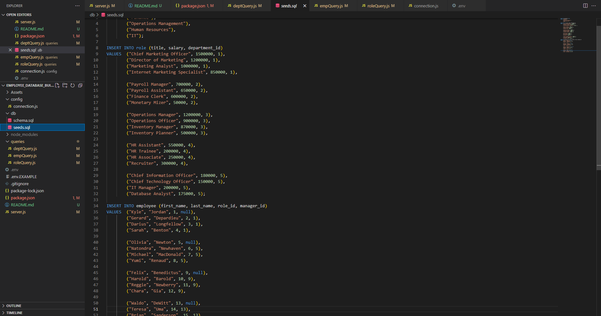

# Employee Database Builder  


## Description

Why did you decide to build this project?

````
For this project, our task is to create a program that allows the user to create a database for their company.

This database will hold a list of departments in the company, a list of all employess, and a list of job roles. All together, when a query is inputted, the user will be able to see the relations between the three tables in the database.
Rather than hard-coding all the data, the user will be able to add the data via a questionnaire!
````

## Table of Contents

- [Installation](#installation)
- [Usage](#usage)
- [Contributing](#contributing)
- [Tests](#tests)
- [Questions](#questions)

## Installation

How to install:

````
- To install this program, you will need to clone this repo to your local machine!
- The next step is to install all of the dependencies; to do this, open up the terminal (the origin should be where the parent folder for the project) and type "npm i". This will install inquirer, express, mysql2, sequelize, and dotenv.
- Now, we need to set up your database connection. Located in the folder is a file called .env.EXAMPLE; this will contain a name value (where youll put your mySQL username), a database value (this can stay as it is), and a password value (where you'll put your mySQL password). Change these values, and then change the name of the file to ".env".
	- NOTE! Make sure you have mySQL downloaded and set up on your local machine! this will be the backbone of the program!
- Finally, you'll have to run you schema and seeds files! In the terminal (the origin should be where the parent folder for the project is), log in to mysql and type "source db/schema.sql" and "source db/seeds.sql" respectively. Exit out of mySQL, and start the program by typing "node server".


- Congrats! you're ready to start coding!
````

## Usage

How does your project work?

````
This progranm will allow the user department data, role data, and employee data, by navigating an inquirer-based directory in the terminal.
It will allow the user to also add new roles, departments, and employees to the databases from the terminal. 
````

## Contributing

How can you contribute to this project?

````
Feel free to leave any comments or critiques about the program!
If there's any unnecessary or over-complicated code, feel free to let me know.
If you improve it in any way, please let me know!

````

## Tests

To run this program:

````
This is a snippet of what the program is doing when it retrieves data from th database for inquirer!
This is for when you want to add a new job for your company!

	function addRole() {
 	 db.execute(`SELECT name, id FROM department`, function (err, results) {
    	if (err) {
    	  console.error(err);
	    }

	    const rawList = Object.values(results);
    	const newList = rawList.map(({ name, id }) => ({ name: name, value: id }));

	    inquirer
    	  .prompt([
        	{
	          type: "input",
    	      message: "What is the name of the new position?",
        	  name: "role_name",
	        },
    	    {
        	  type: "number",
	          message: "What is the salary for this position?",
    	      name: "role_salary",
        	},
	        {
	          type: "list",
    	      message: "What department is this position in?",
        	  name: "role_dept",
	          choices: newList,
    	    },
	      ])
    	  .then((roleData) => {
        	const answers = [
	          roleData.role_name,
    	      roleData.role_salary,
        	  roleData.role_dept,
	        ];

    	    db.execute(
        	  `INSERT INTO role (title, salary, department_id) VALUES ( ?, ?, ? );`,
	          answers,
    	      (err, results) => {
        	    if (err) {
            	  console.error(err);
	            }
    	      }
        	);
        	questionnaire();
	      });
	  });
	}

````


## Questions

If you have any questions, you can contact me through:

- [Github](https://github.com/Loggamon)
- Email: scarletfedora@gail.com

## License & Copyright

© Logan Monson
